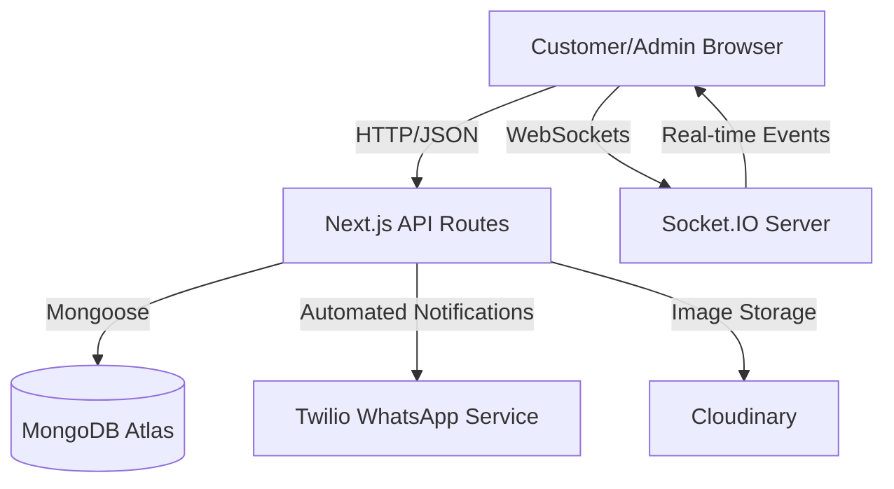
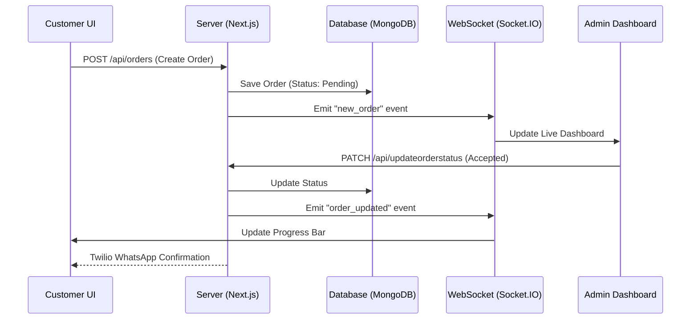
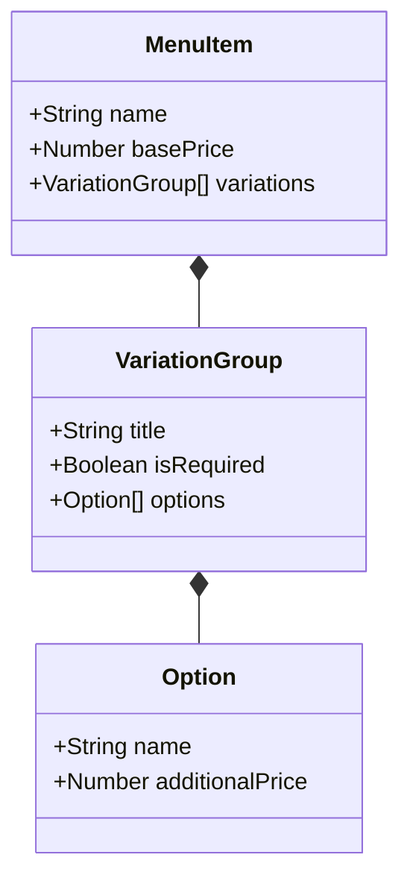

# 🕌 Cafe Little Karachi (CLK)

A premium restaurant management and ordering platform designed for high-end dining experiences. CLK combines a rich, cultural aesthetic with a sophisticated technical architecture to provide a seamless journey for both customers and staff.

---

## 🏗️ System Architecture

CLK is built on a high-performance hybrid architecture that leverages the latest web technologies for real-time responsiveness and data integrity.

---

## 🔄 Order Lifecycle Flow

The following diagram illustrates the lifecycle of an order from customer initiation to real-time status updates.

---

## 🧬 Core Logic: Variation System

One of CLK's strongest features is its granular variation engine, allowing complex item configurations with dynamic pricing.

---

## ✨ Key Technical Highlights

- **⚡ Real-Time Engine**: Built with **Socket.IO** for instantaneous updates across the Customer UI and Admin Dashboard.
- **📱 Hybrid Routing**: Seamless transition between **Next.js App Router** (modern UI) and **Pages Router** (robust API endpoints).
- **🎨 Glassmorphism UI**: High-end visual design using **Tailwind CSS**, **Framer Motion**, and **GSAP** for a premium feel.
- **📊 Behavioral Analytics**: Integrated **PostHog** and **Google Analytics** to track conversion and optimize user flows.
- **🛡️ Secure Data**: Strict schema validation with **Zod** and **Mongoose** for data consistency.

---

## 📁 Project Structure

- `src/app/`: Modern Next.js layouts and components.
- `src/pages/api/`: Optimized API endpoints for order processing.
- `src/context/`: Centralized state management for Cart and Orders.
- `docs/`: Extensive documentation on features and API endpoints.

---

**Little Karachi Express - Empowering Premium Dining.**
*Last Updated: February 2026*
