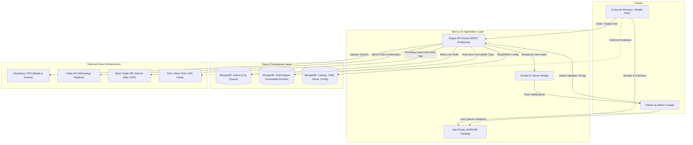
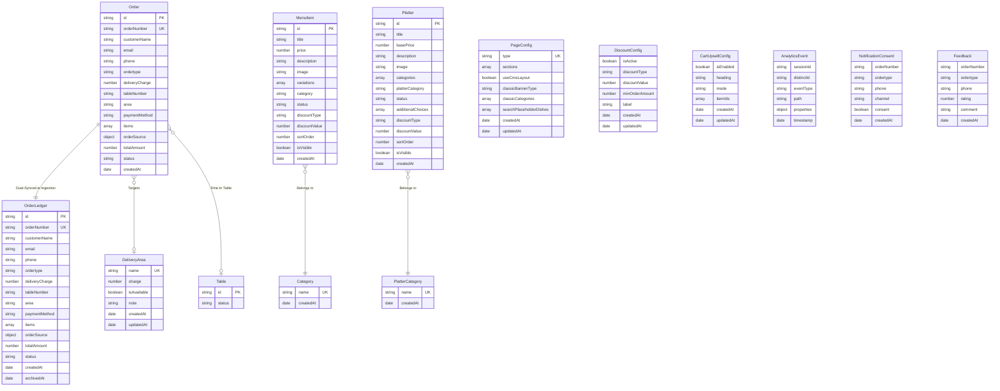
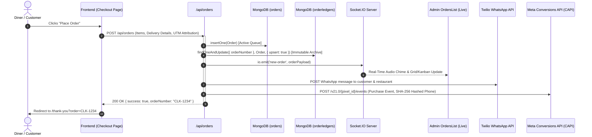
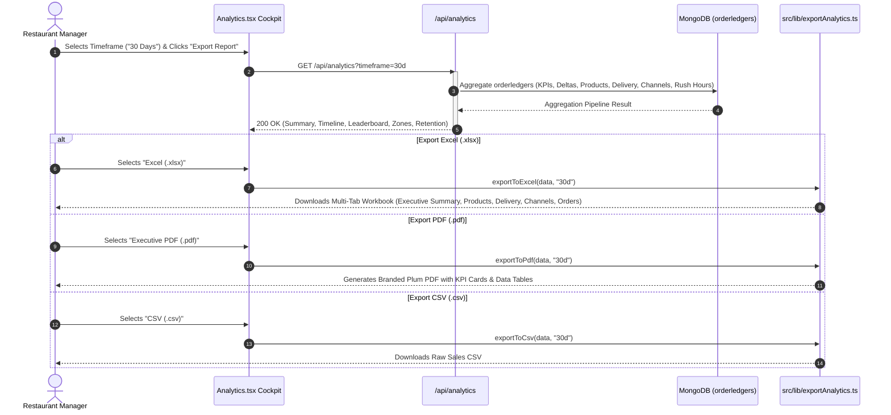

# Architecture & Technical Reference — Cafe Little Karachi (CLK)

> **Platform:** Little Karachi Express (Cafe Little Karachi)  
> **Version:** 4.57 (Production Architecture)  
> **Repository Sub-Project:** `cafe-little-karachi/`  
> **Runtime Target:** Node.js 24.x (`.nvmrc`, `.node-version`, `package.json` engines)  
> **Framework:** Next.js 16.0.8 (Hybrid App Router + Pages Router API) with React 19  
> **Database:** MongoDB 6.11 + Mongoose 8.8.3 ODM  
> **Real-Time Layer:** Socket.IO 4.8.1  
> **Media Infrastructure:** Cloudinary 2.8.0 CDN Pipeline  
> **Primary Design Theme:** Royal Plum (`#741052` / `#5c0d40`) & Luxury Gold  

---

## 1. Executive System Overview

**Cafe Little Karachi (CLK)** is an enterprise-grade, high-concurrency restaurant ordering and kitchen operations platform. The platform serves three distinct fulfillment channels:
1. **Dine-In:** QR-code table ordering with instant kitchen dispatch and digital bill tracking.
2. **Takeaway:** Fast-track pickup ordering with automated status notifications.
3. **Delivery:** Multi-zone logistics routing across 55 Karachi sectors with dynamic distance-based delivery charges and operating-time constraints.

### Core Architectural Principles
- **Dual-Sync Immutable Ledger:** Live order queues are decoupled from analytics via `OrderLedger`, ensuring 100% historical data preservation even when active kitchen queues are purged.
- **Hybrid Next.js Architecture:** SSR and ISR (5-minute revalidation) on the App Router for SEO and initial load speed, combined with Next.js API Routes (Pages Router) for serverless REST and WebSocket bridging.
- **Zero-Loss Interaction-Deferred Analytics:** Third-party scripts (GA4, Meta Pixel, Clarity) are deferred until first user interaction with in-memory buffer stubs, eliminating ~668 KB off the critical path while capturing 100% of conversion events.
- **Resilient Media Pipeline:** Base64/File uploads route through an exponential-backoff retry layer to Cloudinary CDN with singleton protection and Search API timeout guards.
- **Real-Time Operational Cockpit:** Socket.IO bidirectional event pipeline synchronizes customer checkouts, admin live queues (Grid, Kanban, Table, POS Ticket Inspector), and customer live tracking.



---

## 1.1 Archify Interactive Architecture & Diagrams Suite

The system architecture and critical operational pathways are formalized as standalone interactive HTML artifacts generated with the **Archify CLI**:

| Diagram | Type | Artifact File Link | Key Focus |
| :--- | :---: | :--- | :--- |
| **Master Architecture** | `architecture` | [clk-master.html](file:///d:/ordering-system/.archify/architecture-clk-master-20261002-162500/clk-master.html) | 14 core nodes across 5 layers (Clients, Edge & Ingress, Compute & Services, Persistence & Data Layer, Third-Party Egress) |
| **Order Placement & Kitchen Dispatch** | `sequence` | [clk-order-placement.html](file:///d:/ordering-system/.archify/sequence-clk-order-placement-20261002-162500/clk-order-placement.html) | Checkout validation, live `orders` write, immutable `OrderLedger` dual-sync, Socket.IO broadcast, and Twilio WhatsApp |
| **Order Status State Machine** | `lifecycle` | [clk-order-status.html](file:///d:/ordering-system/.archify/lifecycle-clk-order-status-20261002-162500/clk-order-status.html) | Kitchen workflow (`Received` -> `Preparing` -> `OutForDelivery` -> `Delivered` / `Cancelled`), POS undo, and void restore |
| **Customer PII & Marketing Attribution** | `dataflow` | [clk-pii-attribution.html](file:///d:/ordering-system/.archify/dataflow-clk-pii-attribution-20261002-162500/clk-pii-attribution.html) | PII intake sanitization, encryption at rest, SHA-256 Meta CAPI hashing boundary, and Twilio transactional isolation |
| **Order Analytics & Multi-Format Exporter** | `dataflow` | [clk-analytics-export.html](file:///d:/ordering-system/.archify/dataflow-clk-analytics-export-20261002-162500/clk-analytics-export.html) | Aggregation engine (`analytics.ts`, `ledger.ts`), KPI roll-ups, and multi-sheet Excel / CSV / PDF generation |
| **Admin CMS & Media Upload Pipeline** | `workflow` | [clk-admin-cms.html](file:///d:/ordering-system/.archify/workflow-clk-admin-cms-20261002-162500/clk-admin-cms.html) | 5-lane workflow: Page Builder CMS, dnd-kit visual reordering, 90s retry backoff upload engine, and AVIF/WebP CDN delivery |
| **Cache Miss Web Request Flow** | `sequence` | [clk-cache-miss.html](file:///d:/ordering-system/.archify/sequence-clk-cache-miss-20261002-155900/clk-cache-miss.html) | Inbound request -> Redis cache check -> DB query -> Redis SETEX hydration -> client rendering |

---

## 2. Tech Stack & Dependencies Catalog

### 2.1 Core Runtime & Frameworks

| Technology | Version | Purpose |
| :--- | :--- | :--- |
| **Node.js** | `24.x` | Modern LTS JavaScript runtime specified via `package.json` engines, `.nvmrc`, and `.node-version`. |
| **Next.js** | `16.0.8` | Hybrid App Router (SSR, dynamic routes, layout) + Pages Router (`/src/pages/api/`) with Turbopack compilation. |
| **React** | `19.0.0-rc-66855b96` | Component rendering engine utilizing modern hooks, Suspense, and server components. |
| **React DOM** | `19.0.0-rc-66855b96` | DOM renderer matching React 19 core. |
| **TypeScript** | `5.7.2` | Static type safety across all schemas, APIs, contexts, and UI components. |

### 2.2 Database & Data Persistence

| Package | Version | Purpose |
| :--- | :--- | :--- |
| **mongodb** | `6.11.0` | Native MongoDB driver for high-performance operations. |
| **mongoose** | `8.8.3` | Object Data Modeling (ODM) library managing schemas, validation, middleware, and compound indexes. |
| **Database Host** | `MongoDB Atlas` | Multi-tenant cloud cluster with connection pooling and caching singleton (`src/lib/db.ts`). |

### 2.3 Real-Time & Communications

| Package | Version | Purpose |
| :--- | :--- | :--- |
| **socket.io** | `4.8.1` | Server-side WebSocket engine attached to Next.js HTTP server for instant order dispatch and status broadcasting. |
| **socket.io-client** | `4.8.1` | Client-side WebSocket connection for real-time live order updates in Admin cockpit. |
| **twilio** | `5.4.0` | Transactional WhatsApp notifications for order confirmations and kitchen updates. |

### 2.4 Media & Storage

| Package | Version | Purpose |
| :--- | :--- | :--- |
| **cloudinary** | `2.8.0` | Cloud media management, automatic format optimization (AVIF/WebP), Search API querying, and upload retry engine. |
| **formidable** | `3.5.4` | Server-side multipart form data parsing for direct file uploads. |

### 2.5 UI, Styling & Motion Design System

| Package | Version | Purpose |
| :--- | :--- | :--- |
| **tailwindcss** | `3.4.13` | Utility-first styling with custom brand color palette (`#741052`, `#5c0d40`, `#330523`). |
| **tailwindcss-animate** | `1.0.7` | Tailwind animation utility helpers. |
| **tailwind-merge** | `3.3.1` | Utility to safely resolve Tailwind CSS class conflicts. |
| **clsx** | `2.1.1` | Dynamic conditional class string constructor. |
| **class-variance-authority** | `0.7.1` | Type-safe UI component variants. |
| **@radix-ui/react-\*** | Various | Unstyled, accessible primitives (Dialog, Dropdown Menu, Popover, Select, Switch, Checkbox, Toast, Tooltip, Slot, Label). |
| **lucide-react** | `0.542.0` | Primary modern icon library (tree-shaken via `optimizePackageImports`). |
| **react-icons** | `5.3.0` | Supplementary social and brand icons. |
| **framer-motion** | `12.23.22` | Declarative UI animations, modal transitions, drag & drop overlays, and spring physics. |
| **gsap** | `3.13.0` | GreenSock Animation Platform for high-precision timeline sequences. |
| **lottie-react** | `2.4.1` | Vector Lottie animation player for status indicators and celebratory badges. |
| **react-type-animation** | `3.2.0` | Typewriter text animation for hero and search bar placeholders. |
| **next-themes** | `0.4.6` | Seamless dark/light theme switching with zero flash of unstyled content. |
| **sonner** | `2.0.7` | Toast notification manager for system feedback. |

### 2.6 Data Visualization & Business Intelligence

| Package | Version | Purpose |
| :--- | :--- | :--- |
| **recharts** | `2.9.0` | SVG chart library powering the Analytics Cockpit (Revenue Area Timeline, Rush Hour Bar Charts, Channels Donut). |
| **react-countup** | `6.5.3` | Smooth animated numeric counters for executive KPI cards. |
| **xlsx** (SheetJS) | `0.18.5` | Multi-sheet Excel workbook generator (`.xlsx`) for sales reports and accounting audits. |
| **jspdf** | `4.2.1` | Client-side PDF generation engine. |
| **jspdf-autotable** | `5.0.8` | Table plugin for `jspdf` generating branded executive sales PDF reports. |

### 2.7 State Management, Drag & Drop, & Utilities

| Package | Version | Purpose |
| :--- | :--- | :--- |
| **swr** | `2.3.6` | Stale-While-Revalidate client-side data fetching and cache management. |
| **@dnd-kit/core** | `6.3.1` | Drag & drop primitives for catalog reordering and CMS layout building. |
| **@dnd-kit/sortable** | `10.0.0` | Sortable list extensions for `@dnd-kit`. |
| **@dnd-kit/utilities** | `3.2.2` | CSS transform helpers for `@dnd-kit`. |
| **zod** | `4.1.13` | Schema declaration and payload validation. |
| **uuid** | `11.0.3` | RFC4122 UUID generation for order numbers, items, and variations. |
| **dotenv** | `16.4.5` | Environment variable loader. |

---

## 3. Database Architecture & Data Models

All models reside in `src/models/` and connect via the cached connection singleton `src/lib/db.ts`.



---

### 3.1 `MenuItem.ts` (Dishes & Items)
Stores single menu items, portion sizes, pricing, and visual attributes.
- **Collection:** `menuitems`
- **Schema Structure:**
  ```typescript
  {
    id: { type: String, required: true, unique: true, default: uuidv4 },
    title: { type: String, required: true },
    price: { type: Number, required: true },
    description: { type: String, required: true },
    image: { type: String, required: true },
    variations: [{
      name: { type: String },
      price: { type: Number },
      id: { type: String }
    }],
    category: { type: String, required: true },
    createdAt: { type: Date, default: Date.now },
    status: { type: String, enum: ['in stock', 'out of stock'], default: 'in stock' },
    discountType: { type: String, enum: ['percentage', 'fixed'] },
    discountValue: { type: Number, default: 0 },
    sortOrder: { type: Number, default: 0 },
    isVisible: { type: Boolean, default: true }
  }
  ```

---

### 3.2 `Platter.ts` (Gourmet Combo Platters)
Stores gourmet sharing platters, category choices, and add-on matrix.
- **Collection:** `platters`
- **Schema Structure:**
  ```typescript
  {
    id: { type: String, required: true, unique: true, default: uuidv4 },
    title: { type: String, required: true },
    basePrice: { type: Number, required: true },
    description: { type: String, required: true },
    image: { type: String, required: true },
    categories: [{
      categoryName: { type: String },
      selectionType: { type: String, enum: ['category', 'items'], default: 'category' },
      itemIds: [{ type: String }],
      options: [{ name: { type: String } }]
    }],
    platterCategory: { type: String, required: true },
    createdAt: { type: Date, default: Date.now },
    status: { type: String, enum: ['in stock', 'out of stock'], default: 'in stock' },
    additionalChoices: [{
      heading: { type: String, required: true },
      options: [{
        name: { type: String, required: true },
        price: { type: Number, required: true },
        uuid: { type: String, required: true, default: uuidv4 }
      }]
    }],
    discountType: { type: String, enum: ['percentage', 'fixed'] },
    discountValue: { type: Number, default: 0 },
    sortOrder: { type: Number, default: 0 },
    isVisible: { type: Boolean, default: true }
  }
  ```

---

### 3.3 `Order.ts` (Live Orders Queue)
Represents the active kitchen and delivery order queue.
- **Collection:** `orders`
- **Schema Structure:**
  ```typescript
  {
    id: { type: String, default: () => uuidv4(), unique: true },
    orderNumber: { type: String, required: true, unique: true },
    customerName: { type: String, required: true },
    email: { type: String },
    ordertype: { type: String, enum: ['dinein', 'pickup', 'delivery'], required: true },
    deliveryCharge: { type: Number, default: 0 },
    tableNumber: { type: String, default: null },
    area: { type: String, default: null },
    phone: { type: String, default: null },
    paymentMethod: { type: String, required: true },
    items: [{
      id: { type: String, required: true },
      title: { type: String, required: true },
      price: { type: Number, required: true },
      quantity: { type: Number, required: true },
      variations: { type: [String], default: [] }
    }],
    orderSource: {
      source: { type: String, default: 'direct' },
      medium: { type: String, default: null },
      campaign: { type: String, default: null },
      content: { type: String, default: null },
      term: { type: String, default: null },
      referrer: { type: String, default: null },
      landingPage: { type: String, default: null },
      label: { type: String, default: 'Direct / Organic' },
      capturedAt: { type: Date, default: Date.now }
    },
    totalAmount: { type: Number, required: true },
    status: { type: String, required: true }, // 'Received' | 'Delivered' | 'Cancelled'
    createdAt: { type: Date, default: Date.now }
  }
  ```

---

### 3.4 `OrderLedger.ts` (Immutable Historical Sales Archive)
Permanent repository of all orders ever placed. Dual-synced on checkout creation and updated on status mutations. Immune to live order purges.
- **Collection:** `orderledgers`
- **Compound Query Indexes:**
  - `{ createdAt: -1, status: 1 }`
  - `{ createdAt: -1, ordertype: 1 }`
  - `{ createdAt: -1, area: 1 }`
  - `{ 'items.id': 1, createdAt: -1 }`
  - `{ 'items.title': 1, createdAt: -1 }`
- **Schema Structure:**
  ```typescript
  {
    id: { type: String, required: true },
    orderNumber: { type: String, required: true, unique: true, index: true },
    customerName: { type: String, required: true },
    email: { type: String, default: '' },
    phone: { type: String, default: null, index: true },
    ordertype: { type: String, enum: ['dinein', 'pickup', 'delivery'], required: true, index: true },
    deliveryCharge: { type: Number, default: 0 },
    tableNumber: { type: String, default: null },
    area: { type: String, default: null, index: true },
    paymentMethod: { type: String, default: 'cash' },
    items: [{
      id: { type: String, required: true },
      title: { type: String, required: true },
      price: { type: Number, required: true },
      quantity: { type: Number, required: true },
      image: { type: String, default: '' },
      variations: { type: [String], default: [] }
    }],
    orderSource: { ...orderLedgerSourceSchema },
    totalAmount: { type: Number, required: true },
    status: { type: String, required: true, index: true },
    createdAt: { type: Date, required: true, index: true },
    archivedAt: { type: Date, default: Date.now, index: true }
  }
  ```

---

### 3.5 `PageConfig.ts` (Dynamic CMS Layout & Navigation)
Stores the visual ordering page configuration (CMS vs Classic layout, image sliders, sections, rotating search placeholder terms).
- **Collection:** `pageconfigs`
- **Schema Structure:**
  ```typescript
  {
    type: { type: String, required: true, unique: true, default: "order-page" },
    sections: [{
      id: { type: String, required: true },
      type: { type: String, enum: ['hero', 'banner', 'rich-content', 'divider', 'testimonials', 'slider', 'grid', 'image-slider'] },
      title: { type: String, default: "" },
      isVisible: { type: Boolean, default: true },
      props: { type: Schema.Types.Mixed, default: {} }
    }],
    useCmsLayout: { type: Boolean, default: true },
    classicBannerType: { type: String, enum: ['hero', 'image-slider'], default: 'hero' },
    classicCategories: [{
      id: { type: String, required: true },
      name: { type: String, required: true },
      isPlatter: { type: Boolean, default: false },
      isVisible: { type: Boolean, default: true }
    }],
    searchPlaceholderDishes: { type: [String], default: [] }
  }
  ```

---

### 3.6 Other Supporting Models

- **`DeliveryArea.ts` (`deliveryareas`):** Manages 55 active delivery sectors, fees (`charge`), availability (`isAvailable`), and operational notes (`note`).
- **`Category.ts` (`categories`):** Standard dish categories (e.g., `Very Fast Food`, `Beast BBQ`, `Pizza Parlour`, `Hotpot and Chinese`, `Rolls Royce`, `The Chai Company`, `Very Extra`).
- **`PlatterCategory.ts` (`plattercategories`):** Platter grouping categories (`Sharing Platters`, `Meal Boxes`, `Fast Food Deals`).
- **`DiscountConfig.ts` (`discountconfigs`):** Global automatic checkout discounts with minimum order thresholds.
- **`CartUpsellConfig.ts` (`cartupsellconfigs`):** Curated or automated cart recommendations (`auto` vs `manual` item IDs).
- **`tableSchema.ts` (`tables`):** Physical dine-in QR table identifiers and occupancy status (`empty`, `reserved`, `occupied`).
- **`AnalyticsEvent.ts` (`analyticsevents`):** Raw visitor analytics ingestion log (`pageview`, `add_to_cart`, `checkout_start`, etc.).
- **`NotificationConsent.ts` (`notificationconsents`):** Customer opt-in records for WhatsApp status updates.
- **`Feedback.ts` (`feedbacks`):** Customer post-order star ratings (1–5) and reviews.

---

## 4. API Endpoints Catalog & Specifications

All API routes are located in `src/pages/api/` and provide structured JSON responses.

### 4.1 Order Lifecycle & Live Queue APIs

| Endpoint | Method | Description | Key Request Params / Body | Success Response |
| :--- | :---: | :--- | :--- | :--- |
| `/api/orders` | `POST` | Primary checkout handler. Validates order, writes to `Order`, dual-syncs to `OrderLedger`, emits Socket.IO `'new-order'`, triggers Twilio WhatsApp message, and fires Meta CAPI `Purchase` event. | `{ customerName, phone, ordertype, items, totalAmount, paymentMethod, orderSource, area, tableNumber }` | `{ success: true, orderNumber: "CLK-1234", order: { ... } }` |
| `/api/orders` | `GET` | Fetches filtered/paginated live orders. | Query: `status`, `page`, `limit` | `{ success: true, orders: [...], total: 42 }` |
| `/api/fetchorders` | `GET` | Admin fast poll endpoint for active kitchen orders. | None | `Array<Order>` |
| `/api/fetchCompletedOrders` | `GET` | Fetches closed/delivered historical orders from active queue. | None | `Array<Order>` |
| `/api/updateorderstatus` | `PUT` / `POST` | Mutates order status (`Received`, `Delivered`, `Cancelled`). Synchronizes update into `OrderLedger` and emits Socket.IO `'order-status-update'`. | `{ id, status }` or `{ orderNumber, status }` | `{ success: true, message: "Order status updated", order: { ... } }` |
| `/api/orders/purge-completed` | `POST` | Safe Live Queue Purge API. Deletes delivered/cancelled orders from live `Order` queue after verifying 100% presence in `OrderLedger`. | `{ olderThanDays: 30, statuses: ['Delivered', 'Cancelled'] }` | `{ success: true, purgedCount: 15, message: "15 orders safely purged" }` |
| `/api/deleteorder` | `DELETE` / `POST` | Deletes a single live order from the active queue. | `{ id }` or `{ orderNumber }` | `{ success: true, message: "Order deleted" }` |
| `/api/order-status` | `GET` | Customer tracking endpoint. Fetches single order status. | Query: `orderNumber` or `id` | `{ success: true, order: { status, orderNumber, items, totalAmount } }` |
| `/api/getOrderByTableId` | `GET` | Look up active dine-in table order by table number. | Query: `tableId` | `{ success: true, order: { ... } }` |

---

### 4.2 Catalog, Dishes & Platters APIs

| Endpoint | Method | Description | Key Request Params / Body | Success Response |
| :--- | :---: | :--- | :--- | :--- |
| `/api/getitems` | `GET` | Public storefront dish catalog. Returns active/in-stock menu items. | Query: `category` (optional) | `Array<MenuItem>` |
| `/api/getitemsadmin` | `GET` | Admin dish catalog. Returns all items including hidden/out-of-stock. | None | `Array<MenuItem>` |
| `/api/get-items-by-ids` | `POST` | Hydrates multiple dishes/platters for cart checkout verification. | `{ ids: ["uuid1", "uuid2"] }` | `{ success: true, items: [...] }` |
| `/api/menuitems` | `POST` | Creates a new menu item. | `IMenuItem` payload + Base64 image | `{ success: true, item: { ... } }` |
| `/api/updateItem` | `PUT` / `POST` | Updates an existing menu item with Cloudinary upload resilience. | `{ id, title, price, image, variations, ... }` | `{ success: true, item: { ... } }` |
| `/api/bulkUpdateMenuItems` | `PUT` | Batch updates dish status (in/out of stock) or prices. | `{ items: [{ id, status, price }] }` | `{ success: true, updatedCount: 5 }` |
| `/api/bulkUpdateCategoryDiscount` | `POST` | Applies percentage or fixed discounts across an entire category. | `{ category, discountType, discountValue }` | `{ success: true, message: "Discount applied to X items" }` |
| `/api/updateProductSortOrder` | `PUT` | Updates drag & drop visual display sort order for dishes. | `{ items: [{ id, sortOrder: 0 }, { id, sortOrder: 1 }] }` | `{ success: true }` |
| `/api/platter` | `GET` | Public storefront combo platter catalog. | Query: `category` (optional) | `Array<Platter>` |
| `/api/platteradmin` | `GET` | Admin combo platter catalog. | None | `Array<Platter>` |
| `/api/createPlatter` | `POST` | Creates a new combo platter. | `IPlatter` payload + Base64 image | `{ success: true, platter: { ... } }` |
| `/api/updatePlatter` | `PUT` / `POST` | Updates a combo platter with additional choices and category options. | `{ id, title, basePrice, image, categories, additionalChoices, ... }` | `{ success: true, platter: { ... } }` |
| `/api/bulkUpdatePlatters` | `PUT` | Batch updates platter stock status or prices. | `{ platters: [{ id, status, basePrice }] }` | `{ success: true }` |
| `/api/categories` | `GET` / `POST` | List all menu categories or create a new one. | `{ name }` | `Array<Category>` |
| `/api/categories/seed` | `POST` | Seeds default restaurant categories into MongoDB. | None | `{ success: true, count: 7 }` |
| `/api/platter-categories` | `GET` / `POST` | List all platter categories or create a new one. | `{ name }` | `Array<PlatterCategory>` |
| `/api/platter-categories/seed` | `POST` | Seeds default platter categories into MongoDB. | None | `{ success: true, count: 3 }` |

---

### 4.3 Business Intelligence & Analytics APIs

| Endpoint | Method | Description | Key Request Params / Body | Success Response |
| :--- | :---: | :--- | :--- | :--- |
| `/api/analytics` | `GET` / `POST` | **Comprehensive Analytics Engine.** Queries `OrderLedger` (fallback `Order`), computes executive KPIs, period-over-period growth deltas, product leaderboards, low-velocity dishes, delivery rankings, channels split, peak rush hours, day-of-week, basket affinity, and customer retention. | Query: `timeframe` (`today`, `yesterday`, `7d`, `last-week`, `30d`, `last-month`, `year`, `custom`), `startDate`, `endDate` | `{ success: true, summary: { totalRevenue, totalOrders, aov, aoq, revenueGrowth, ordersGrowth, ... }, timeline: [...], productSales: [...], stagnantDishes: [...], deliveryAreas: [...], channels: [...], rushHours: [...], dayOfWeek: [...], basketAffinity: [...], retention: { ... } }` |
| `/api/analytics/ledger` | `GET` | **Historical Order Ledger Explorer.** Searchable, paginated audit API for historical tickets. | Query: `search`, `status`, `ordertype`, `page`, `limit`, `startDate`, `endDate` | `{ success: true, orders: [...], totalOrders: 180, totalPages: 18, page: 1 }` |
| `/api/analytics/dashboard` | `GET` | Lightweight dashboard summary for quick admin HUD loading. | None | `{ revenueToday, ordersToday, activeOrdersCount }` |
| `/api/analytics/details` | `GET` | Granular metrics breakdown by date interval. | Query: `from`, `to` | `{ detailedMetrics: [...] }` |
| `/api/analytics/track` | `POST` | First-party visitor journey event ingestion. | `{ eventType, sessionId, distinctId, properties, path }` | `{ success: true }` |
| `/api/analytics/meta-capi` | `POST` | Server-Side Meta Conversions API proxy with SHA-256 PII hashing. | `{ eventName, eventId, userData, customData }` | `{ success: true, data: { ... } }` |
| `/api/analytics/archive-summary`| `GET` | Summarizes orders preserved in ledger versus active queue. | None | `{ totalLedgerCount, totalLiveCount, purgedCount }` |
| `/api/order-source-analytics` | `GET` | Marketing attribution intelligence (Facebook Ads, Instagram Ads, Google, Direct, WhatsApp). | Query: `timeframe` (`today`, `7d`, `30d`, `90d`, `all`) | `{ totalOrders, totalRevenue, paidVsOrganic, channels, campaigns, timeline }` |

---

### 4.4 CMS, Media, Logistics & Operational APIs

| Endpoint | Method | Description | Key Request Params / Body | Success Response |
| :--- | :---: | :--- | :--- | :--- |
| `/api/page-config` | `GET` / `POST` | Reads or updates the visual CMS page configuration, banner slider slides, and search placeholder terms. | `{ sections, useCmsLayout, classicBannerType, classicCategories, searchPlaceholderDishes }` | `{ success: true, pageConfig: { ... } }` |
| `/api/media` | `GET` | Lists Cloudinary media gallery assets. Uses Search API with 20s timeout and falls back to Admin Resources API. | Query: `next_cursor`, `folder`, `search` | `{ success: true, resources: [...], next_cursor: "..." }` |
| `/api/media` | `POST` | Multi-image drag & drop upload to Cloudinary folder `cafe-little-karachi/gallery`. | `{ images: ["data:image/png;base64,..."] }` or `{ file: "..." }` | `{ success: true, uploaded: [...] }` |
| `/api/media` | `DELETE` | Deletes single or bulk assets from Cloudinary. | `{ publicIds: ["cafe-little-karachi/..."] }` | `{ success: true, deleted: { ... } }` |
| `/api/media-usage` | `GET` | Scans catalog items, platters, and CMS sections to audit media usage and find unused images. | None | `{ usedMedia: [...], unusedMedia: [...] }` |
| `/api/upload` | `POST` | Single direct image upload handler. | `{ image: "base64-data" }` | `{ url: "https://res.cloudinary.com/..." }` |
| `/api/delivery-areas` | `GET` / `POST` / `PUT` / `DELETE` | CRUD management for 55 Karachi delivery sectors. | `{ name, charge, isAvailable, note }` | `{ success: true, areas: [...] }` |
| `/api/discount-config` | `GET` / `POST` | Configures global checkout discount promotions. | `{ isActive, discountType, discountValue, minOrderAmount, label }` | `{ success: true, config: { ... } }` |
| `/api/cart-upsells` | `GET` / `POST` | Configures cart sidebar upsell recommendations. | `{ isEnabled, heading, mode, itemIds }` | `{ success: true, config: { ... } }` |
| `/api/tables` | `GET` / `POST` | Lists all QR tables or creates new table records. | `{ id, status }` | `Array<Table>` |
| `/api/tables/[id]` | `GET` / `PUT` / `DELETE` | Operations on single QR table. | Query: `id` | `{ success: true, table: { ... } }` |
| `/api/socket` | `GET` / `POST` | Socket.IO server initialization and WebSocket upgrade handshake. | None | WebSockets Handshake |
| `/api/send-whatsapp` | `POST` | Automated Twilio WhatsApp message trigger for order notifications. | `{ to, orderNumber, customerName, totalAmount, status }` | `{ success: true, sid: "SM..." }` |
| `/api/order-feedback` | `POST` | Ingests post-order customer reviews and star ratings. | `{ orderNumber, rating, comment, phone, ordertype }` | `{ success: true }` |
| `/api/notification-consent` | `POST` | Records customer opt-in consent for WhatsApp order alerts. | `{ orderNumber, phone, channel: "whatsapp", consent: true }` | `{ success: true }` |

---

## 5. Frontend Architecture & Component Tree

### 5.1 Route Hierarchy (Next.js 16 App Router)

```
src/app/
├── layout.tsx                     # Root Layout: Metadata, Fonts, Global Providers, Deferred Analytics
├── page.tsx                       # Root Route: SSR Menu Loader + Server Component
├── order/
│   └── page.tsx                   # Order Page: Catalog, Dynamic CategoryNavStrip, Search, Modals
├── item/
│   └── [slug]/
│       └── page.tsx               # Dynamic Product Route: Dish SSR metadata + Instant Customization Modal
├── platter/
│   └── [slug]/
│       └── page.tsx               # Dynamic Platter Route: Platter SSR metadata + Platter Customizer Modal
├── table/
│   └── [tableId]/
│       └── page.tsx               # Dine-In Table QR Route: Auto-sets Dine-In mode + Table ID
├── delivery/
│   └── [area]/
│       └── page.tsx               # Delivery Campaign Route: Auto-sets Delivery mode + Sector
├── checkout/
│   └── page.tsx                   # Frictionless Checkout: Mode Switcher, Address, WhatsApp Opt-in
├── thank-you/
│   └── page.tsx                   # Order Confirmation: Live Tracking, Receipt Download, Review Modal
├── admin/
│   └── page.tsx                   # Admin Cockpit: Live Queue, Analytics, CMS Builder, Media Gallery
├── manifest.ts                    # Native PWA Web App Manifest
├── robots.ts                      # SEO Crawl Rules & Search Bot Directives
└── sitemap.ts                     # Dynamic Image Sitemap querying MongoDB
```

### 5.2 Global State & Context Providers

1. **`CartContext.tsx` (`useCart`):**
   - Manages in-memory and persistent cart items (`localStorage`).
   - Synchronizes cart drawer opening/closing (`isCartOpen`, `openCart`, `closeCart`, `toggleCart`).
   - Calculates item count, subtotal, discount deductions, and total amount.
   - Synchronizes with `<FloatingCartButton />` and `<Header />`.
2. **`OrderContext.tsx` (`useOrder`):**
   - Manages fulfillment mode (`ordertype: 'dinein' | 'pickup' | 'delivery'`).
   - Manages delivery area (`area`), table ID (`tableNumber`), and contact details (`phone`, `customerName`).
   - Dual-persists state in both `localStorage` and HTTP Cookies for SSR availability.
   - Detects direct-link ad visitors (`isDirectLinkCustomer`) to suppress premature popups.
   - Controls operating hours status modal (`isStatusModalOpen`, `setStatusModalOpen`) and product popup suppression (`isProductModalOpen`).

### 5.3 Key UI Components Directory

| Component | Path | Description |
| :--- | :--- | :--- |
| **`Header.tsx`** | `src/app/components/Header.tsx` | Customer header with circular brand emblem, fulfillment mode switcher, location pin, theme toggle, and lazy `CartSidebar` trigger. Suppressed on `/admin*`. |
| **`AdminHeader.tsx`** | `src/app/components/AdminHeader.tsx` | Dedicated administration header with system status indicator, live digital clock, audio alert chimes, live store link, and workspace lock. |
| **`SearchBar.tsx`** | `src/app/components/SearchBar.tsx` | Luxury borderless pill search bar with type-and-delete rotating placeholder, smooth focus expansion (280px → 620px), and inline floating search results modal. |
| **`CategoryNavStrip.tsx`** | `src/app/components/CategoryNavStrip.tsx` | Sticky horizontal category bar with lavender pill styling, smooth scroll navigation (85px offset), chevron arrows, and `IntersectionObserver` scroll-spy. |
| **`BannerSlider.tsx`** | `src/app/components/BannerSlider.tsx` | Contain-fit carousel slider with ambient blurred backdrop glow, single-banner mobile aspect ratio adaptability, and touch swipe. |
| **`MenuItem.tsx`** | `src/app/components/MenuItem.tsx` | Dish card with top-right discount pill badge (`% OFF` / `Rs. OFF`), stock tags, and customization modal (portion prices, variation matrix, `- / +` stepper). |
| **`PlatterItem.tsx`** | `src/app/components/PlatterItem.tsx` | Combo platter card with discount badge and multi-category selection modal. |
| **`AddToCartButton.tsx`** | `src/app/components/AddToCartButton.tsx` | Tactile button with in-button slide animation (`Add to Cart` → `✓ Added!`) preserving signature brand plum gradient. |
| **`FloatingCartButton.tsx`**| `src/app/components/FloatingCartButton.tsx`| Top-right floating button with scroll reveal, item counter, and low-opacity `@keyframes cartRadarPing` sonar pulse ring. |
| **`CartSidebar.tsx`** | `src/app/components/CartSidebar.tsx` | Lazy-loaded cart drawer with full-screen backdrop blur, promo code discounts, and popular upsell carousel. |
| **`TableForm.tsx`** | `src/app/components/TableForm.tsx` | Universal order mode selector modal mounted globally in `layout.tsx` for Dine-In, Delivery, and Takeaway. |
| **`RestaurantStatusPopup.tsx`**| `src/app/components/RestaurantStatusPopup.tsx`| Operating hours lock modal (6:30 PM – 3:00 AM) with live countdown and dev bypass. |
| **`Footer.tsx`** | `src/app/components/Footer.tsx` | Centered modern tea lounge footer with brand halo glow, interactive contact pills (Call, WhatsApp, Maps), and social icons. |
| **`OrdersList.tsx`** | `src/app/components/OrdersList.tsx` | Admin live orders workspace featuring 4 HUD metric cards, 4 view modes (Grid, Kanban, Table, POS Ticket Inspector), and 1-click Cancel/Restore workflow. |
| **`Analytics.tsx`** | `src/app/components/Analytics.tsx` | Executive Analytics Cockpit: Recharts Area timeline, Rush hours, Channels donut, Product Leaderboard, Low-Velocity alerts, Historical Ledger Drawer, Safe Purge Modal, and Multi-Format Exporter (XLSX, CSV, PDF). |
| **`MediaGallery.tsx`** | `src/app/components/MediaGallery.tsx` | Full drag & drop Cloudinary media manager with search, format filters, progress display, and side-by-side inspection modal. |
| **`AdminPageBuilder.tsx`** | `src/app/components/AdminPageBuilder.tsx` | Visual drag & drop CMS page builder for hero banners, category sliders, grids, and mockups. |
| **`SearchBarManagement.tsx`**| `src/app/components/SearchBarManagement.tsx`| Admin panel for managing rotating dish phrases with live search simulation. |

---

## 6. End-to-End Operational Workflows

### 6.1 Order Creation & Dual-Sync Sequence



---

### 6.2 Analytics Aggregation & Multi-Format Export Flow



---

## 7. Performance, SEO & Infrastructure Security

### 7.1 Performance Engineering
- **First-Party JS Optimization:** Configured `experimental.optimizePackageImports` in `next.config.ts` for `lucide-react`, `react-icons`, and `framer-motion`. Tree-shakes icon barrels, reducing bundle sizes.
- **Dynamic Component Code-Splitting:** Dynamic lazy loading (`next/dynamic`, `ssr: false`) applied to `CartSidebar` (~33 KB off critical path), `PlatterItem` (~23 KB), and `BannerSlider` (~13 KB).
- **Browserslist Target:** Set to `chrome >= 111, edge >= 111, firefox >= 111, safari >= 16.4, ios_saf >= 16.4`, eliminating ~26 KB of legacy polyfills and generator transforms.
- **Image Optimization:** Supported formats `['image/avif', 'image/webp']` with 1-year cache TTL (`minimumCacheTTL: 31536000`), eager LCP priority on initial hero slide (`idx === 0`), and responsive `sizes` definitions preventing bandwidth waste.
- **Scroll-Spy Without Forced Reflows:** `CategoryNavStrip` uses `IntersectionObserver` rather than continuous scroll-event `getBoundingClientRect` reads.

### 7.2 Zero-Loss Interaction-Deferred Analytics
- **Stubs Library (`src/app/lib/analytics-stubs.ts`):** Injects memory-buffered queue shims for `window.dataLayer`/`gtag`, `window.fbq`, and `window.clarity` on initial mount.
- **Deferred Loader (`src/app/components/DeferredAnalytics.tsx`):** Listens for passive first user interaction (`pointerdown`, `keydown`, `scroll`, `touchstart`) with a 6-second idle fallback before injecting external scripts (`googletagmanager.com`, `connect.facebook.net`, `clarity.ms`), eliminating ~668 KB payload and ~1s CPU blocking from initial page load.

### 7.3 SEO & Structured Data Architecture
- **Dynamic OpenGraph & Twitter Cards:** Dynamic `generateMetadata` in `item/[slug]/page.tsx` and `platter/[slug]/page.tsx` generates dish-specific social cards with Cloudinary dish imagery.
- **Schema.org JSON-LD:** Global `RestaurantJsonLd.tsx` injects `Restaurant`, `FoodEstablishment`, `WebSite`, and `BreadcrumbList` schemas; `ProductJsonLd.tsx` injects `Product` and `MenuItem` schemas.
- **Dynamic Sitemap & Robots:** Native Next.js App Router `sitemap.ts` builds Google Image Sitemap entries from MongoDB; `robots.ts` restricts AI scrapers while permitting search engines.

### 7.4 Cloudinary Media Hardening & Network Recovery
- **Singleton Poison Guard (`src/lib/cloudinary.ts`):** Validates all environment variables before calling `cloudinary.config()`, preventing configuration wiping.
- **Exponential Backoff Retry (`uploadToCloudinaryWithRetry`):** 90-second socket timeout with 3-attempt exponential backoff retry for transient network drops (`ECONNRESET`, `ETIMEDOUT`, `-4077`).
- **Search API Timeout Guard (`src/pages/api/media.ts`):** 20-second `Promise.race` guard triggering automatic fallback to Admin Resources API.

---

## 8. Environment Variables Specification

Ensure all variables are defined in `.env.local` (local development) and `.env.production` (deployment):

```env
# Node & Runtime
NODE_ENV=production

# MongoDB Atlas
MONGODB_URI=mongodb+srv://<username>:<password>@cluster.mongodb.net/cafe-little-karachi?retryWrites=true&w=majority

# Cloudinary CDN Pipeline
CLOUDINARY_CLOUD_NAME=your_cloud_name
CLOUDINARY_API_KEY=your_api_key
CLOUDINARY_API_SECRET=your_api_secret

# Meta / Facebook Marketing & CAPI
NEXT_PUBLIC_META_PIXEL_ID=1619761243277122
META_PIXEL_ID=1619761243277122
META_CONVERSIONS_API_TOKEN=your_meta_capi_access_token

# Google Analytics & Clarity
NEXT_PUBLIC_GA_ID=G-XXXXXXXXXX
NEXT_PUBLIC_CLARITY_ID=your_clarity_project_id

# Twilio WhatsApp Notifications
TWILIO_ACCOUNT_SID=your_twilio_account_sid
TWILIO_AUTH_TOKEN=your_twilio_auth_token
TWILIO_WHATSAPP_NUMBER=whatsapp:+14155238886
RESTAURANT_WHATSAPP_NOTIFICATION_NUMBER=whatsapp:+923331702706

# Operating Hours Dev Override (Optional)
NEXT_PUBLIC_DISABLE_HOURS_LOCK=false
```
