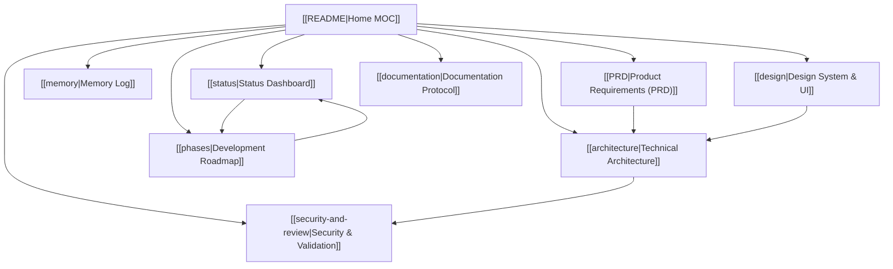

# 🍽️ Advanced Ordering Ecosystem — Obsidian Vault

Welcome to the **Obsidian Vault** for the **Advanced Ordering Ecosystem**. This vault contains interconnected technical specifications, design tokens, architecture diagrams, progress dashboards, and development roadmaps for both restaurant platforms in this monorepo.

---

## 🚀 Projects Overview

| Project | Folder | Description | Theme |
|---|---|---|---|
| **Cafe Little Karachi (CLK)** | `cafe-little-karachi/` | Premium dine-in & takeaway with granular variation engine | Pink/Magenta |
| **The Chai Company (TCC)** | `the-chai-company/` | High-speed quick-service cafe ordering | Sleek Dark |

---

## 🧭 Vault Navigation & Knowledge Graph

---

## 📚 Master Notes Directory

| Note Name | Description | Key Tags |
|---|---|---|
| 🎯 **[[NEXT_STEPS\|Next Steps & Handoff Guide]]** | Step-by-step next action plan & ready-to-copy AI prompts for session handoffs | `#type/guide` `#status/active` |
| 📊 **[[status\|Status Dashboard]]** | Executive progress tracking, feature readiness matrix, & active task checklists | `#type/status` `#status/active` |
| 🧠 **[[memory\|Memory Log]]** | Living memory log of all decisions, session history, & architectural updates | `#type/memory` `#status/active` |
| 📄 **[[PRD\|Product Requirements (PRD)]]** | Full product specification across all modules for CLK and TCC | `#type/prd` `#scope/full-platform` |
| 🏗️ **[[architecture\|Technical Architecture]]** | Next.js hybrid routing, MongoDB schemas, Socket.IO event system, & API contracts | `#type/architecture` `#tech/mongodb` |
| 🎨 **[[design\|Design System & UI]]** | CLK pink/magenta tokens, TCC styling, Framer Motion specs, & component wireframes | `#type/design` `#tech/tailwind` |
| 🚀 **[[phases\|Development Roadmap]]** | Feature phases from MVP to Multi-Branch support | `#type/roadmap` `#phase/mvp` |
| 🔒 **[[security-and-review\|Security & Validation]]** | Input validation, auth guards, Zod schemas, XSS prevention, & code review checklist | `#type/security` `#security/validation` |
| 📑 **[[documentation\|Documentation Protocol]]** | Documentation standards, change log formats, inline commentary, & ADR log | `#type/protocol` `#standard/adr` |

---

## 🎨 Visual Obsidian Canvas
- Open the interactive **[[Ordering System Architecture.canvas]]** file in Obsidian to view the complete visual node graph connecting system components, data flow, and roadmap phases.

---

## 🏷️ Tag Index
- `#type/prd` — Product Requirements Documents
- `#type/architecture` — System Architecture & DB Schemas
- `#type/design` — UI/UX & Design Tokens
- `#type/roadmap` — Phase Delivery Schedules
- `#type/security` — Security & Validation Policies
- `#type/status` — Live Execution & Progress Tracking
- `#status/active` — Currently Active Modules
- `#project/clk` — Cafe Little Karachi specific
- `#project/tcc` — The Chai Company specific
