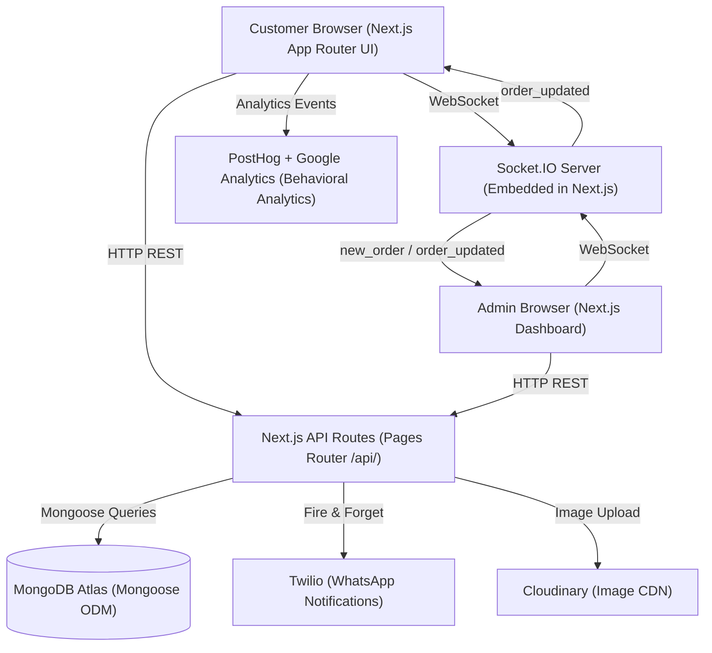
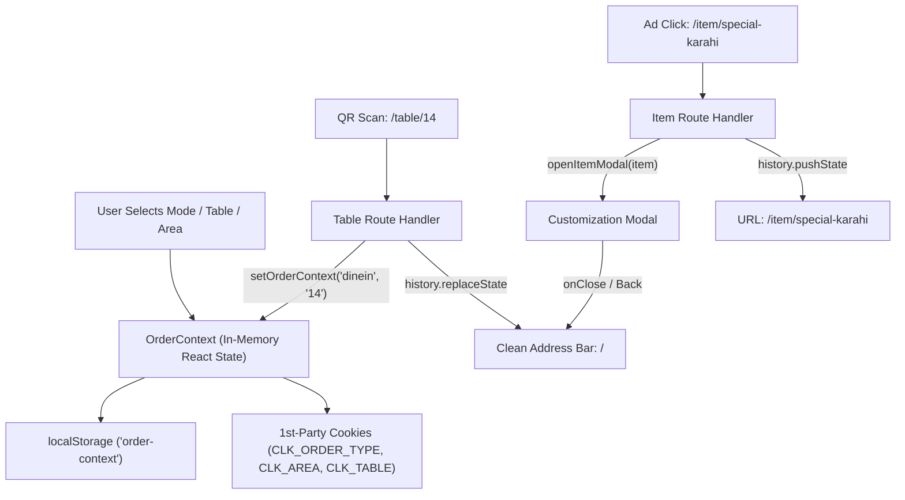

# Technical Architecture & System Specification — Advanced Ordering Ecosystem

- **Location**: `documentation/architecture.md`
- **Vault Links**: [[README|Home MOC]] | [[PRD|PRD Specs]] | [[design|Design Tokens]] | [[security-and-review|Security]] | [[status|Status]]

---

## 1. High-Level Architecture Diagram



---

## 2. Hybrid Routing & Clean URL Architecture

The ecosystem uses Next.js's **hybrid routing** approach with a **Site-Wide Clean URL Architecture**:

| Router / Layer | Path | Responsibility |
|---|---|---|
| **App Router Root** | `src/app/page.tsx` | Main ordering catalog, hero, categories, and active order interface directly on `/` |
| **Dynamic Item Entrypoint** | `src/app/item/[slug]/page.tsx` | Ad campaign entrypoint for single items; renders menu with item customization modal auto-opened |
| **Dynamic Platter Entrypoint** | `src/app/platter/[slug]/page.tsx` | Ad campaign entrypoint for platters; renders menu with platter customization modal auto-opened |
| **Dine-In QR Entrypoint** | `src/app/table/[tableId]/page.tsx` | QR code entrypoint; saves table to persistent context and silently normalizes URL to `/` |
| **Delivery Area Entrypoint** | `src/app/delivery/[area]/page.tsx` | Marketing share link; saves area to persistent context and silently normalizes URL to `/` |
| **Checkout & Tracking** | `src/app/checkout/`, `src/app/thank-you/` | Clean checkout without query params; resilient multi-source order tracking |
| **Pages Router API** | `src/pages/api/` | All API endpoints (REST + Socket.IO handler + Webhooks) |

---

## 3. Dual-Layer Persistence Engine (`OrderContext.tsx`)

To eliminate messy URL query strings (`?type=...&area=...&tableId=...`) across the customer journey, order context is maintained via a **dual-layer persistence architecture**:



- **Browser Storage**: `localStorage` maintains `order-context`, `latest_order_number`, `latest_order_type`, and `latest_order_phone`.
- **First-Party Cookies**: `CLK_ORDER_TYPE`, `CLK_AREA`, `CLK_TABLE` allow server components and edge middleware to read session context synchronously without client hydration delays.
- **Legacy URL Migration**: Legacy query string URLs (e.g. `/order?type=delivery&area=Gulshan`) are automatically intercepted, state is absorbed into `OrderContext`, and the browser URL is silently replaced with `/`.

---

## 4. MongoDB Schema Specifications

### 4.1 MenuItem Schema

```typescript
// src/models/MenuItem.ts
import mongoose, { Schema, Document } from 'mongoose';

interface IOption {
  name: string;
  additionalPrice: number;
}

interface IVariationGroup {
  title: string;
  isRequired: boolean;
  options: IOption[];
}

export interface IMenuItem extends Document {
  name: string;
  description: string;
  basePrice: number;
  categoryId: mongoose.Types.ObjectId;
  imageUrl: string;       // Cloudinary URL
  isAvailable: boolean;
  variations: IVariationGroup[];
  createdAt: Date;
  updatedAt: Date;
}

const MenuItemSchema = new Schema<IMenuItem>({
  name: { type: String, required: true, trim: true },
  description: { type: String, default: '' },
  basePrice: { type: Number, required: true, min: 0 },
  categoryId: { type: Schema.Types.ObjectId, ref: 'Category', required: true, index: true },
  imageUrl: { type: String, default: '' },
  isAvailable: { type: Boolean, default: true, index: true },
  variations: [{
    title: { type: String, required: true },
    isRequired: { type: Boolean, default: false },
    options: [{ name: String, additionalPrice: { type: Number, default: 0 } }]
  }]
}, { timestamps: true });
```

### 4.2 Order Schema

```typescript
// src/models/Order.ts
export type OrderStatus = 'Received' | 'Preparing' | 'Ready' | 'Out for delivery' | 'Completed' | 'Cancelled';

export interface IOrderItem {
  id: string;
  title: string;
  price: number;
  quantity: number;
  variations?: string[];
}

export interface IOrder extends Document {
  orderNumber: string;
  customerName: string;
  phone?: string;
  email?: string;
  ordertype: 'dinein' | 'pickup' | 'delivery';
  tableNumber?: string;
  area?: string;
  paymentMethod: string;
  status: OrderStatus;
  items: IOrderItem[];
  totalAmount: number;
  deliveryCharge?: number;
  createdAt: Date;
  updatedAt: Date;
}

const OrderSchema = new Schema<IOrder>({
  orderNumber: { type: String, required: true, unique: true, index: true },
  customerName: { type: String, required: true },
  phone: { type: String },
  email: { type: String },
  ordertype: { type: String, enum: ['dinein', 'pickup', 'delivery'], required: true, index: true },
  tableNumber: { type: String, index: true },
  area: { type: String },
  paymentMethod: { type: String, default: 'cash' },
  status: { 
    type: String, 
    enum: ['Received', 'Preparing', 'Ready', 'Out for delivery', 'Completed', 'Cancelled'], 
    default: 'Received', 
    index: true 
  },
  items: [{
    id: String,
    title: String,
    price: Number,
    quantity: Number,
    variations: [String]
  }],
  totalAmount: { type: Number, required: true },
  deliveryCharge: { type: Number, default: 0 }
}, { timestamps: true });
```

---

## 5. API Route Contracts (Pages Router)

| Method | Route | Description |
|---|---|---|
| `GET` | `/api/menuitems` | Fetch all menu items |
| `GET` | `/api/orders` | Fetch orders for admin dashboard (returns array or object) |
| `POST` | `/api/orders` | Place a new customer order & broadcast via Socket.IO |
| `GET` | `/api/order-status` | Fetch real-time status by `orderNumber` or `tableId` |
| `PUT` | `/api/updateorderstatus` | Transition order lifecycle status |
| `GET` | `/api/getOrderByTableId` | Lookup active order number by table ID |
| `GET` | `/api/categories` | Fetch item categories |
| `GET` | `/api/delivery-areas` | Fetch delivery zones and delivery charges |
| `GET` | `/api/socket` | Socket.IO handshake endpoint |

---

## 6. Real-Time & Polling Architecture

1. **Customer Order Status Tracking (`/thank-you`)**:
   - Multi-source parameter resolution: `order`, `orderNumber`, `id`, `tableId`, or `localStorage` fallback.
   - Polls `/api/order-status` at 10-second intervals for real-time customer status updates.
2. **Admin Order Queue (`OrdersList.tsx`)**:
   - Universal response parsing: handles bare array, `{ orders: [] }`, or `{ data: [] }`.
   - Automated background polling every **2 minutes (120,000ms)** to minimize unnecessary server load.
   - Dedicated **"Refresh Orders" manual button** with live spinning state for instant on-demand fetching.
   - Real-time Web Audio API sound alert on incoming orders.

---

## 7. State Management Architecture (React Context)

| Context | File | Responsibility |
|---|---|---|
| `CartContext` | `src/app/context/CartContext.tsx` | In-memory shopping cart, items, quantities, add/remove/update |
| `OrderContext` | `src/app/context/OrderContext.tsx` | Dual-persistence location, order mode, table ID, location modal visibility |

---

## 8. Architectural Decision Records (ADR Log)

| # | Decision | Rationale | Date |
|---|---|---|---|
| ADR-001 | MongoDB + Mongoose over SQL | Document model fits nested variation groups natively; no complex joins for menu queries | 2026-08-28 |
| ADR-002 | Hybrid Next.js Routing | Pages Router API routes have first-class Socket.IO support; App Router handles modern UI | 2026-08-28 |
| ADR-003 | React Context over Redux | Cart/Order state is simple enough; avoids external library overhead for this scale | 2026-08-28 |
| ADR-004 | Fire-and-forget Twilio calls | Twilio failures must NEVER block order persistence or customer confirmation | 2026-08-28 |
| ADR-005 | Monorepo Structure | Unified governance docs, shared architecture DNA, independent deployment targets | 2026-08-28 |
| ADR-006 | Site-Wide Clean URL Architecture | Eliminates query strings from user flow, moves main menu to root `/`, and enables ad deep-linking | 2026-09-04 |
| ADR-007 | Dual-Layer State Persistence | Combines `localStorage` with first-party Cookies for resilient client + SSR location context | 2026-09-04 |
| ADR-008 | Admin 2-Minute Polling + Manual Refresh | Reduces database overhead while giving admin immediate manual sync capability | 2026-09-04 |
