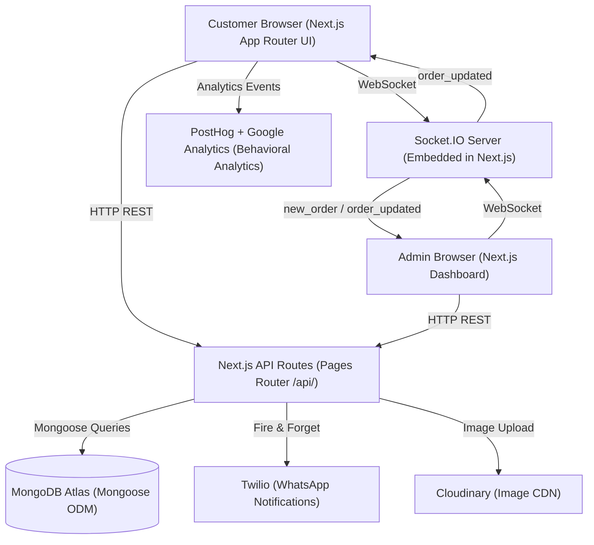

# Technical Architecture & System Specification — Advanced Ordering Ecosystem

- **Location**: `documentation/architecture.md`
- **Vault Links**: [[README|Home MOC]] | [[PRD|PRD Specs]] | [[design|Design Tokens]] | [[security-and-review|Security]] | [[status|Status]]

---

## 1. High-Level Architecture Diagram



---

## 2. Hybrid Routing Architecture

The ecosystem uses Next.js's **hybrid routing** approach:

| Router | Path | Responsibility |
|---|---|---|
| **App Router** | `src/app/` | All UI pages, layouts, and client components |
| **Pages Router** | `src/pages/api/` | All API endpoints (REST + Socket.IO handler) |

### Why Hybrid?
- App Router provides modern RSC architecture for fast UI rendering.
- Pages Router's API routes have more mature support for Socket.IO server integration and complex middleware patterns.

---

## 3. MongoDB Schema Specifications

### 3.1 MenuItem Schema

```typescript
// src/models/MenuItem.ts
import mongoose, { Schema, Document } from 'mongoose';

interface IOption {
  name: string;
  additionalPrice: number;
}

interface IVariationGroup {
  title: string;
  isRequired: boolean;
  options: IOption[];
}

export interface IMenuItem extends Document {
  name: string;
  description: string;
  basePrice: number;
  categoryId: mongoose.Types.ObjectId;
  imageUrl: string;       // Cloudinary URL
  isAvailable: boolean;
  variations: IVariationGroup[];
  createdAt: Date;
  updatedAt: Date;
}

const MenuItemSchema = new Schema<IMenuItem>({
  name: { type: String, required: true, trim: true },
  description: { type: String, default: '' },
  basePrice: { type: Number, required: true, min: 0 },
  categoryId: { type: Schema.Types.ObjectId, ref: 'Category', required: true, index: true },
  imageUrl: { type: String, default: '' },
  isAvailable: { type: Boolean, default: true, index: true },
  variations: [{
    title: { type: String, required: true },
    isRequired: { type: Boolean, default: false },
    options: [{ name: String, additionalPrice: { type: Number, default: 0 } }]
  }]
}, { timestamps: true });
```

### 3.2 Order Schema

```typescript
// src/models/Order.ts
export type OrderStatus = 'pending' | 'accepted' | 'preparing' | 'ready' | 'completed' | 'cancelled';

export interface IOrderItem {
  menuItemId: mongoose.Types.ObjectId;
  name: string;
  basePrice: number;
  selectedVariations: Record<string, string>; // groupTitle → optionName
  additionalPrice: number;
  quantity: number;
  totalPrice: number;
}

export interface IOrder extends Document {
  items: IOrderItem[];
  tableNumber?: string;       // undefined for takeaway
  customerPhone?: string;     // for Twilio WhatsApp
  status: OrderStatus;
  totalAmount: number;
  notes?: string;
  createdAt: Date;
  updatedAt: Date;
}

const OrderSchema = new Schema<IOrder>({
  items: [{ /* IOrderItem fields */ }],
  tableNumber: { type: String, index: true },
  customerPhone: { type: String },
  status: { type: String, enum: ['pending','accepted','preparing','ready','completed','cancelled'], default: 'pending', index: true },
  totalAmount: { type: Number, required: true },
  notes: { type: String }
}, { timestamps: true });
```

### 3.3 Category Schema

```typescript
// src/models/Category.ts
export interface ICategory extends Document {
  name: string;
  slug: string;
  displayOrder: number;
  isActive: boolean;
}
```

---

## 4. API Route Contracts (Pages Router)

| Method | Route | Description |
|---|---|---|
| `GET` | `/api/menu` | Fetch all available menu items grouped by category |
| `POST` | `/api/menu` | Create a new menu item (admin only) |
| `PATCH` | `/api/menu/[id]` | Update menu item (price, availability, variations) |
| `DELETE` | `/api/menu/[id]` | Soft-delete a menu item |
| `GET` | `/api/orders` | Fetch all active orders (admin dashboard) |
| `POST` | `/api/orders` | Place a new customer order |
| `PATCH` | `/api/updateorderstatus` | Update order status (admin action) |
| `GET` | `/api/categories` | Fetch all categories |
| `POST` | `/api/categories` | Create a new category |
| `GET` | `/api/socket` | Socket.IO handshake endpoint |

---

## 5. Real-Time Event System (Socket.IO)

### Event Map

| Event | Direction | Payload | Trigger |
|---|---|---|---|
| `new_order` | Server → Admin | `{ orderId, tableNumber, items[], totalAmount }` | After `POST /api/orders` saves to DB |
| `order_updated` | Server → Customer & Admin | `{ orderId, status }` | After `PATCH /api/updateorderstatus` saves to DB |
| `table_status_update` | Server → All | `{ tableNumber, status }` | After table status changes |

### Socket.IO Server Setup Pattern

```typescript
// src/pages/api/socket.ts
import { Server as SocketIOServer } from 'socket.io';
import type { NextApiRequest, NextApiResponse } from 'next';

export default function handler(req: NextApiRequest, res: NextApiResponse & { socket: any }) {
  if (!res.socket.server.io) {
    const io = new SocketIOServer(res.socket.server, {
      path: '/api/socket',
      cors: { origin: '*' }
    });
    res.socket.server.io = io;
  }
  res.end();
}
```

---

## 6. State Management Architecture (React Context)

| Context | File | Responsibility |
|---|---|---|
| `CartContext` | `src/contexts/CartContext.tsx` | Cart items, quantities, add/remove/update operations |
| `OrderContext` | `src/contexts/OrderContext.tsx` | Active order ID, current status, Socket.IO subscription |
| `TableContext` | `src/contexts/TableContext.tsx` | Selected table number for the current dine-in session |

All contexts wrap at the root layout (`src/app/layout.tsx`) to ensure global availability.

---

## 7. Key Architectural Decisions (ADR Log)

| # | Decision | Rationale | Date |
|---|---|---|---|
| ADR-001 | MongoDB + Mongoose over SQL | Document model fits nested variation groups natively; no complex joins for menu queries | 2026-08-28 |
| ADR-002 | Hybrid Next.js Routing | Pages Router API routes have first-class Socket.IO support; App Router handles modern UI | 2026-08-28 |
| ADR-003 | React Context over Redux | Cart/Order state is simple enough; avoids external library overhead for this scale | 2026-08-28 |
| ADR-004 | Fire-and-forget Twilio calls | Twilio failures must NEVER block order persistence or customer confirmation | 2026-08-28 |
| ADR-005 | Cloudinary for media | Automatic image optimization, CDN delivery, and Next.js `<Image>` loader compatibility | 2026-08-28 |
