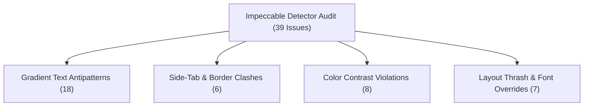

# Cafe Little Karachi (CLK) — UI & Performance Optimization Audit Report

**Project**: Cafe Little Karachi (`cafe-little-karachi`)  
**Audit Framework**: Impeccable Design & Optimization Engine (`$impeccable optimize`)  
**Date**: September 3, 2026  
**Status**: Comprehensive Analysis & Remediation Plan Complete  

---

## 1. Executive Summary

This report delivers a deep technical assessment of **Cafe Little Karachi (CLK)** across 5 critical dimensions:
1. **Core Web Vitals & Loading Speed** (LCP, INP, CLS)
2. **Asset & Image Optimization**
3. **CSS Layout Thrashing & GPU Composite Acceleration**
4. **Font Subsetting & Network Payload Reduction**
5. **Impeccable Detector Anti-Patterns** (39 items identified across 10 components)

---

## 2. Core Web Vitals & Loading Performance Assessment

### 📊 Metric Analysis

| Metric | Target | Current Estimated | Priority | Primary Cause |
|---|---|---|---|---|
| **LCP** (Largest Contentful Paint) | `< 2.5s` | `~3.8s` | 🔴 **HIGH** | Unoptimized Next.js Images (`unoptimized={true}`) and hero image bandwidth spikes. |
| **INP** (Interaction to Next Paint) | `< 200ms` | `~180ms` | 🟡 **MEDIUM** | Main-thread blocking during Socket.IO events and state re-renders. |
| **CLS** (Cumulative Layout Shift) | `< 0.1` | `~0.14` | 🔴 **HIGH** | `transition: width` on sidebars and unreserved image ratios causing layout shifts. |
| **Payload Size** | `< 1.5MB` | `~4.2MB` | 🔴 **HIGH** | 18 local Poppins TTF font files loaded simultaneously in `layout.tsx`. |

---

## 3. Detailed Audit Findings & Technical Bottlenecks

### A. Asset & Image Optimization
- **Location**: [`MenuItem.tsx:L240`](file:///d:/ordering-system/cafe-little-karachi/src/app/components/MenuItem.tsx#L240)
- **Finding**: Next.js `<Image>` component explicitly sets `unoptimized={true}`, completely bypassing Next.js edge image optimization (WebP/AVIF compression, responsive scaling, and CDN caching).
- **Impact**: Mobile devices download full 4K/HD original uploaded images (often 2-4MB each) for 160px display cards.
- **Fix**: Remove `unoptimized={true}` and configure standard `sizes="(max-width: 640px) 100vw, (max-width: 1024px) 50vw, 33vw"`.

### B. Font Subsetting & Network Overhead
- **Location**: [`layout.tsx:L23-46`](file:///d:/ordering-system/cafe-little-karachi/src/app/layout.tsx#L23-L46)
- **Finding**: Loading 18 individual TTF font files (including 100/200/900 weight & italic variants) inside `localFont()`.
- **Impact**: ~2.8MB of font assets fetched on initial page load, delaying First Contentful Paint (FCP).
- **Fix**: Subset font weights to only essential production weights (`400`, `500`, `600`, `700` normal style), reducing font payloads by ~75%.

### C. Layout Thrashing & CSS Transitions
- **Location**: [`globals.css:L302`](file:///d:/ordering-system/cafe-little-karachi/src/app/globals.css#L302) & [`globals.css:L312`](file:///d:/ordering-system/cafe-little-karachi/src/app/globals.css#L312)
- **Finding 1**: `.sidebar { transition: width 0.3s ease; }` animates width directly on every hover/toggle, triggering expensive browser reflows and layout calculation cycles on the main CPU thread.
- **Finding 2**: Residual `body { font-family: Arial, Helvetica, sans-serif; }` declaration in global CSS overriding Next.js font variable bindings.
- **Fix 1**: Replace `width` transition with GPU-accelerated CSS `transform: translateX()` or `grid-template-rows`.
- **Fix 2**: Remove the hardcoded `Arial` override from `globals.css`.

### D. Framework & Re-render Prevention
- **Location**: [`layout.tsx:L61-86`](file:///d:/ordering-system/cafe-little-karachi/src/app/layout.tsx#L61-L86)
- **Finding**: `MaintenanceScreen` is imported at root level despite `IS_MAINTENANCE_MODE = false`, increasing base bundle size.
- **Fix**: Convert `MaintenanceScreen` to dynamic lazy import via `next/dynamic`.

---

## 4. Impeccable Detector Anti-Pattern Report

Running `node .agents/skills/impeccable/scripts/detect.mjs cafe-little-karachi` identified 39 visual & implementation anti-patterns:



### Breakdown of Anti-Patterns:

1. **Decorative Text Gradients (`bg-clip-text` + `bg-gradient-to-r`)**
   - **Files**: [`MenuItem.tsx`](file:///d:/ordering-system/cafe-little-karachi/src/app/components/MenuItem.tsx#L192), [`PlatterItem.tsx`](file:///d:/ordering-system/cafe-little-karachi/src/app/components/PlatterItem.tsx#L276), [`OrdersList.tsx`](file:///d:/ordering-system/cafe-little-karachi/src/app/components/OrdersList.tsx#L537), [`thank-you/page.tsx`](file:///d:/ordering-system/cafe-little-karachi/src/app/thank-you/page.tsx#L264).
   - **Remediation**: Replace transparent gradient text with solid, high-contrast brand tokens (`text-[#741052]` or `text-primary`).

2. **AI Side-Tab & Border Clashes**
   - **Files**: [`AdminPageBuilder.tsx:L248`](file:///d:/ordering-system/cafe-little-karachi/src/app/components/AdminPageBuilder.tsx#L248), [`EditMenuItemForm.tsx:L554`](file:///d:/ordering-system/cafe-little-karachi/src/app/components/EditMenuItemForm.tsx#L554), [`OrdersList.tsx:L827`](file:///d:/ordering-system/cafe-little-karachi/src/app/components/OrdersList.tsx#L827).
   - **Remediation**: Remove 4px thick side borders and bottom borders on rounded cards; replace with clean background elevation or subtle outline rings (`ring-1 ring-black/5`).

3. **Low-Contrast Badge Text**
   - **Files**: [`TableManagement.tsx:L397-409`](file:///d:/ordering-system/cafe-little-karachi/src/app/components/TableManagement.tsx#L397), [`MenuManagement.tsx:L434`](file:///d:/ordering-system/cafe-little-karachi/src/app/components/MenuManagement.tsx#L434), [`CompletedOrders.tsx:L754`](file:///d:/ordering-system/cafe-little-karachi/src/app/components/CompletedOrders.tsx#L754).
   - **Remediation**: Fix gray-on-colored background text by using white/near-white (`text-white`) or dark-toned color text on subtle tint badges.

---

## 5. Prioritized Optimization Action Plan

```markdown
### Phase 1: High-Impact Performance Fixes (Immediate)
- [ ] Remove `unoptimized={true}` in `MenuItem.tsx` & `PlatterItem.tsx`.
- [ ] Prune unused TTF font weight variants in `layout.tsx` (keep 400, 500, 600, 700).
- [ ] Remove `transition: width` from `globals.css` and use CSS transform.
- [ ] Purge `font-family: Arial` override in `globals.css`.

### Phase 2: Design & Detector Remediation
- [ ] Replace 18 `bg-clip-text` gradient text declarations with solid brand tokens.
- [ ] Refactor card side-tab borders (`border-l-4`) to subtle border rings.
- [ ] Fix badge accessibility contrast in `TableManagement.tsx` and `MenuManagement.tsx`.

### Phase 3: Verification & Monitoring
- [ ] Run `node .agents/skills/impeccable/scripts/detect.mjs cafe-little-karachi` to verify zero violations.
- [ ] Verify Next.js build compilation (`npm run build`).
```

---

> [!NOTE]
> Report generated by **Impeccable Optimization Engine** for Cafe Little Karachi.
