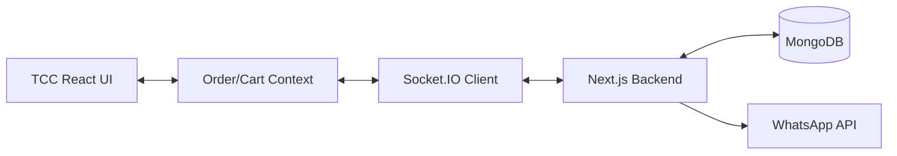
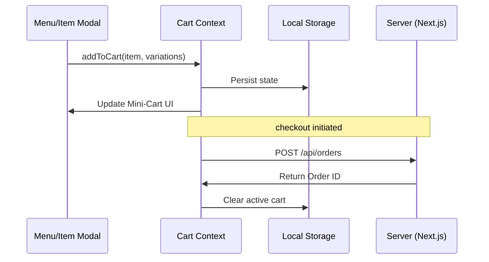

# 🍵 The Chai Company (TCC)

A high-speed, visually stunning ordering platform optimized for quick-service and cafe environments. TCC focuses on a frictionless checkout experience and a specialized management system for platter-based menus.

---

## 🏗️ System Architecture

TCC shares the robust hybrid architecture of the ecosystem, optimized for high-concurrency and rapid UI updates.

---

## 🛒 Cart & Synchronization Flow

TCC utilizes a sophisticated synchronization mechanism to ensure the cart state is always consistent across different views and devices.

---

## 📊 Technical Capabilities

- **🚀 Ultra-Fast Checkout**: Minimized friction flow designed for rapid order placement.
- **🔄 Real-Time Dashboard**: Immediate feedback for customers and instant alerts for kitchen staff via WebSockets.
- **🍱 Platter Management**: Specialized data model and UI for managing grouped items and bundle deals.
- **🖼️ Premium Media**: Integrated with **Cloudinary** for high-resolution, optimized menu imagery.
- **📈 Advanced Analytics**: Deep event tracking via **PostHog** to understand popular items and peak hours.

---

## 🎨 Design System

TCC adheres to a minimalist yet impactful design system:
- **Typography**: Clean, modern fonts (Poppins/Inter).
- **Animations**: Fluid transitions powered by **GSAP** for a "living" UI feel.
- **Responsive**: Mobile-first architecture ensures a perfect experience on any device.

---

## 📁 Internal Breakdown

- `src/app/checkout/`: Specialized checkout logic and state handling.
- `src/components/forms/`: Reusable, accessible form components.
- `src/models/`: Shared Mongoose schemas for consistent data handling.
- `scripts/`: Utility scripts for menu and order management.

---

**The Chai Company - Rapid Service, Premium Experience.**
*Last Updated: February 2026*
